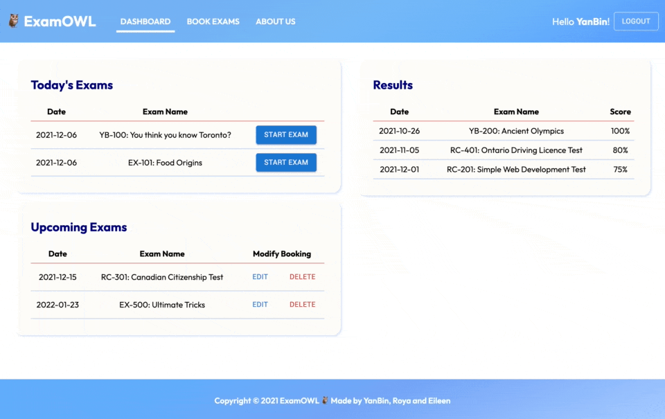

# 🦉 ExamOWL

Welcome to ExamOWL, an exam proctoring application where students can book and take exams remotely on their browser. We also created an activity monitor to detect suspicious behaviours with the help of Tensorflow's machine learning models to help alleviate the burden of exam proctors who oversees the exam. 

This MVP was created in less than two weeks by [YanBin Yuan](https://github.com/YBYuan007), [Roya Chobineh](https://github.com/royachobineh) and [Eileen Xue](https://github.com/eileenxue) as their final project as part of Lighthouse Lab's Full-Stack Web Development Bootcamp.

## Getting Started
For the purpose of this project, both backend and frontend are in this repo. To get started, run `npm install` for both folders in separate terminals and do `npm start` for both. 

We used PostgreSQL for the database. Refer to the .env.example for more details. To reset the database, run `node bin/resetdb.js` in the backend folder.

### Overview of Application

## Main Features

### Book, Edit, Delete Exams
Students can book a new exam appointment, edit or delete any upcoming exams...except today's!

### Activty Monitoring
When the student starts an exam, we demonstrate that the proctor can also monitor that exam. In the proctor's activity monitor, they are able to detect if the student is not focus on the current screen (which is evident during our demo as we focus on the proctor's window). We used Teachable Machine to train our own basic audio models to distinguish between different audio noise. We also used Tensorflow's Simple Face Detection model for our webcam feature. To communicate in the live chat and for the activity monitor, we used socket.io.

### Exam Component
For the exam feature, when students do not get a perfect score, they have the option to retake the exam if admins allow multiple attempts. Otherwise, if they receive a perfect score, they can just submit that.

## Credits
